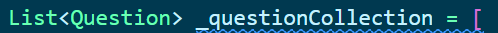

# quizzler_flutter

A quiz Flutter project.

## Key Points

- List
- Dart
  - class constructor
- Object Oriented Programming
  - Abstraction
  - Encapsulation
  - Inheritance
  - Polymorphism

## Display Effects

## Summary

### Step1: Structure of the Widgets
- The Text class has the `textAlign` property. To center the text , use `textAlign: TextAlign.center`. The display effect is as shown below: 
- `TextButton` has the `style` property. If you want to set a background color for your `TextButton`, use `style: TextButton.styleFrom(backgroundColor: Colors.green)`.

### Step2: Complete the Logic of the Row Widget at the Bottom

1. Define a null List that will contains ✔ & ❌ icons.
2. Because of the row widget is relative to UI display when user presses ✔ or ❌ button, it's better to complete the logic of the `setState` property first. If you want to debug the project, just give the `correctAnswer` a bool value.
### Step3: Complete the Part of Question Collection

1. Define a class `Qustion` that encapsulates the question context and question answer as a `question` object.
2. Create another class that includes a List named `questionCollection` .This List will wrap all question objects.
3. Use the underscore to make the `questionCollection` List a private and create getter method, so that the List cannot be updated from outside and can only be  accessed through the getter method. 
4. create an `questionCollection` object in `main.dart` file to modify code related to the `questionText` and `answer`;
5. After pressing the button, you should update the question. 
   - Define a method named `nextQuestion` in the `QuestionCollection` class.
   - Call the `nextQuestion` method in the `setState` property to implement the updating of the UI.

### Episode: Merge Duplicate Code

The code inside the curly braces of `onPress` property is duplicate. It is better to extract these parts as a method. I will call the method `updateUI`, and I should pass a parameter to this method to indicate the user's selected answer.
On the green `TextButton`, if the user selects `true`, I will pass `ture` to the `updateUI(bool userSelect)` method, and the same applies to the red `TextButton`.

### Step4: Add a Hint Card When the Last Question is Completed
The number of the question is limited. When the user completed the last question, it should give the user an alert. So I have to check whether the current question is the last question. If it is, float an alter card on the user interface, clear all icons on the interface, and restart the quiz. If it isn't the last question, continue with the next question.

1. create a method named `isLastQuestion()` in the `QuestionCollection` class.
   Use the `_questionNumber` to check whether the current question is the last.
2. Create a method: `reset()` in the `QuestionCollection` class as the `_questionNumber` is defined in the `QuestionCollection` class. 
